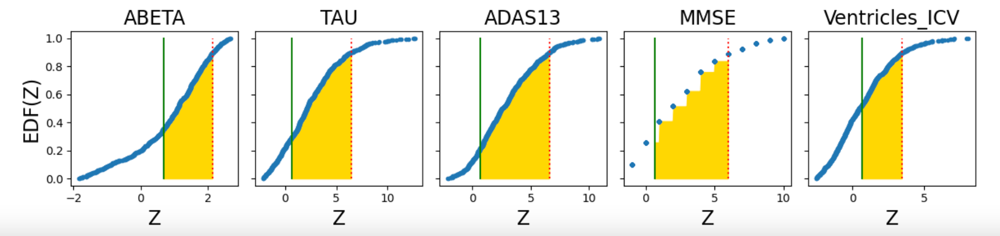

# Goldilocks DPM

A Disease Progression Modelling (DPM) implementation of the Goldilocks framework for data-driven model configuration.

Goldilocks (conference paper: [Oxtoby, AAIC 2024](https://doi.org/10.1002/alz.092363)) is a framework for helping users ensure that their data-driven model of choice is configured "just right" for the available data. Conceptually, Goldilocks informs on feature selection and hyperparameter tuning, with respect to signal in the data. This complements work in the field of explainable AI.



## Contents

1. [goldilocks\_dpm](goldilocks_dpm): python module for implementing the Goldilocks framework within data-driven DPM.
    1. [demos](goldilocks_dpm/demos): folder containing demo implementations of various DPMs.
        1. [README](goldilocks_dpm/demos/README.md): describes the `goldilocks-dpm` workflow
        1. [goldilocks-pysustain.py](goldilocks_dpm/demos/goldilocks-pysustain.py): **Su**btype and **Sta**ge **In**ference
        1. Calls [plot\_SuStaIn\_model\_arbitrarycolours.py](goldilocks_dpm/demos/plot_SuStaIn_model_arbitrarycolours.py) which demos how to use arbitrary colours in SuStaIn model plotting (thanks to Alex Young for help with this).
    1. **TODO**. [goldilocks\_ebm.py](): Event-Based Model (GMM, KDE, Ordinal Scored Events)
1. [ADNIMERGE2023_synthetic.csv](goldilocks_dpm/demos/ADNIMERGE2023_synthetic.csv): Data mimicking [ADNI](https://adni.loni.usc.edu) data based on ADNIMERGE.csv downloaded in May 2023.
    1. [synthetic_data.ipynb](goldilocks_dpm/demos/synthetic_data.ipynb): Jupyter notebook for generating the above, FYI (don't try to run it unless you have an ADNIMERGE CSV to feed into it).


## Workflow

See [goldilocks-pysustain.py](goldilocks_dpm/demos/goldilocks-pysustain.py) for a worked example using ZScoreSustain.

```
## 1. Prepare your data

## 2. Create a Goldilocks DPM object and run the framework

## ZScoreSuStaIn
from goldilocks_dpm import goldilocks_ZscoreSustain

gdpm = goldilocks_ZscoreSustain(
    classes = y,
    dpmData = X,
    output_folder = "path/to/output_folder",
    robust_zscores = False,
    case_label = 1,
    ctrl_label = 0, 
    direction_abnormal = direction_abnormal,
    biomarker_labels = biomarkers
)

gdpm.run_goldilocks()

## 3. Interrogate the resulting output.
print(gdpm.Z_vals)
print(gdpm.Z_max)

```

## Licence

MIT.